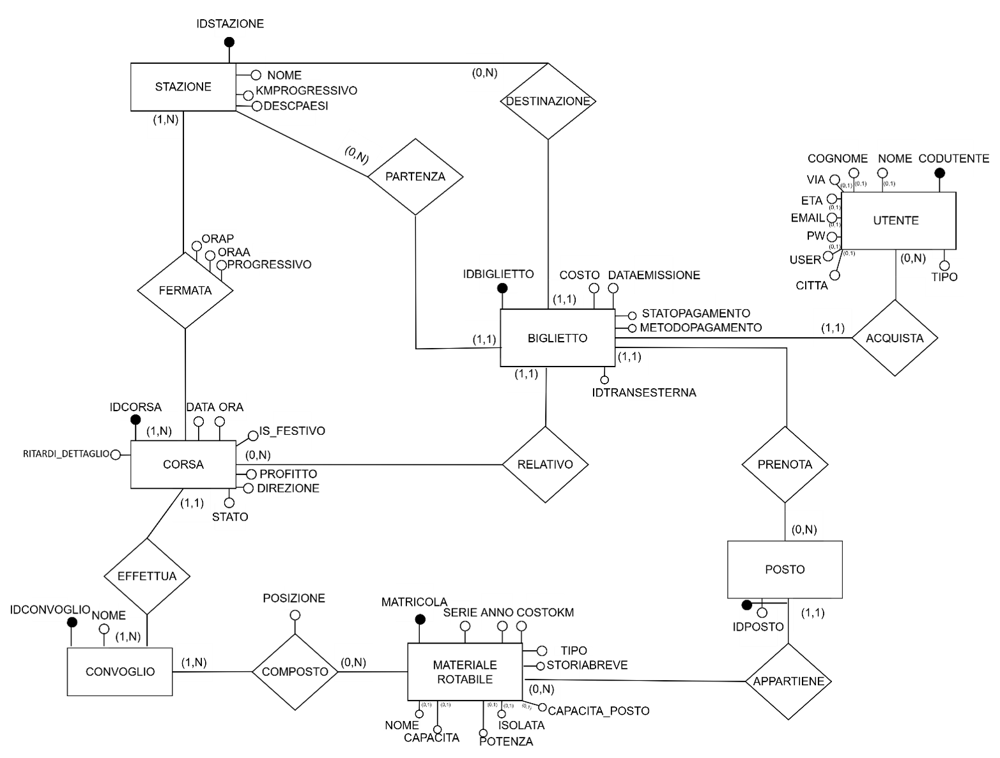
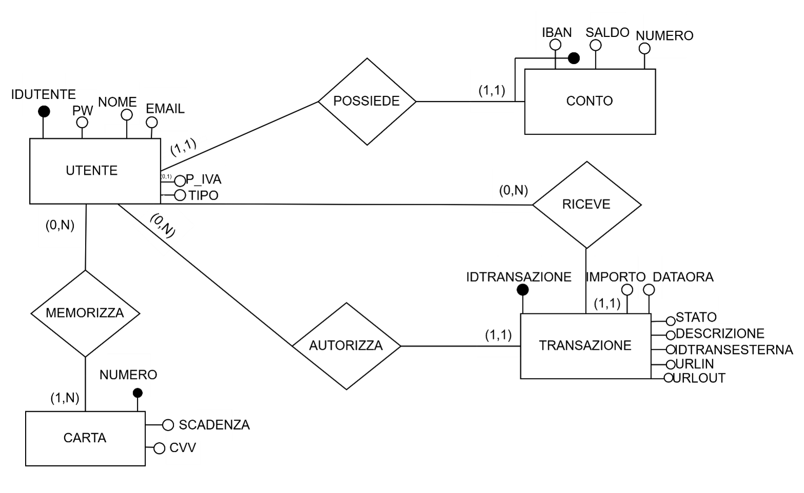

# SFT & PaySteam

Progetto sviluppato per l'esame di **Basi di Dati e di Conoscenza**  
Università degli Studi Guglielmo Marconi

### 🔗 Versioni sul portale universitario
- **SFT (Società Ferroviaria Turistica)** → https://webstudenti.unimarconi.it/gio.fuso/SFT/
- **PaySteam (Gateway di pagamento)** → https://webstudenti.unimarconi.it/gio.fuso/PAY/

Si tratta di due web application sviluppate in **PHP** e **MySQL** che dialogano tra loro: **SFT**, la piattaforma di vendita biglietti di una società ferroviaria turistica e **PaySteam**, il gateway di pagamento che SFT utilizza per incassare gli acquisti. L'obiettivo era riprodurre, in piccolo, il funzionamento di due servizi web reali che comunicano via API, partendo dalla progettazione del database fino all'implementazione completa di entrambe le applicazioni.

## SFT — Società Ferroviaria Turistica

SFT gestisce una linea ferroviaria turistica di **54 km con 10 stazioni**. Sulla linea circolano 4 coppie di treni storici nei giorni festivi (tutto l'anno) e 1 coppia nei giorni feriali, ma solo nel periodo estivo (dal 1° giugno al 30 settembre). Ogni treno ha una composizione variabile di locomotive e carrozze.

L'applicazione permette ai clienti di:

- consultare gli orari e cercare le corse disponibili tra due stazioni
- acquistare un biglietto online con prenotazione del posto a sedere
- vedere il prezzo calcolato automaticamente in base ai chilometri percorsi e alla composizione del treno

Esistono inoltre due aree riservate:

- un **backoffice di esercizio** per gestire orari, treni e composizioni delle carrozze
- un **backoffice amministrativo** che calcola la redditività di ogni treno, confrontando i ricavi con i costi

## PaySteam — Pagamenti online

PaySteam è un servizio di pagamento pensato per essere richiamato da applicazioni esterne (come fa SFT in questo progetto). Gli utenti si registrano come **consumatori** o come **esercenti** e collegano al proprio profilo un conto corrente in euro oppure una carta di credito.


## Come comunicano SFT e PaySteam

L'integrazione tra le due applicazioni segue il flusso tipico di un gateway di pagamento esterno, basato su uno scambio **M2M** (machine-to-machine) e un identificativo univoco di transazione (**UUID**) che fa da filo conduttore tra i due sistemi:

1. l'utente prenota un biglietto su SFT e clicca su *"Paga"*
2. SFT genera un **UUID** che identifica la transazione e lo conserva nel proprio database
3. SFT contatta PaySteam via M2M e invia l'identificativo dell'esercente, l'importo, la descrizione del pagamento e l'UUID generato
4. PaySteam registra i dati ricevuti in attesa che l'utente completi il pagamento
5. SFT reindirizza l'utente su PaySteam passando l'UUID nell'URL
6. L'utente si autentica su PaySteam con le proprie credenziali (account distinto da quello SFT)
7. PaySteam usa l'UUID per recuperare i dati della transazione e mostrarli all'utente
8. L'utente conferma e PaySteam esegue il movimento contabile, addebitando il consumatore e accreditando l'esercente
9. PaySteam notifica a SFT, sempre via M2M, l'UUID della transazione con l'esito (ok / ko)
10. PaySteam reindirizza l'utente su SFT, che a questo punto può emettere il biglietto

Il vantaggio di questo schema è che SFT non vede mai le credenziali di pagamento dell'utente e PaySteam non sa nulla del biglietto: ciascun sistema lavora solo sui dati di propria competenza e l'UUID garantisce che le due metà del flusso si "ritrovino" in modo univoco.

## Documentazione

La cartella [`docs/`](./docs) contiene la documentazione completa di progettazione dei due database — schemi E/R, schema logico relazionale, tabella dei volumi e analisi delle operazioni principali — in formato PDF.

Di seguito un'anteprima visiva degli schemi Entità-Relazione.

### Schema E/R — SFT



📄 [Documentazione completa di SFT](./docs/SFT/documentazione-sft.pdf)

### Schema E/R — PaySteam



📄 [Documentazione completa di PaySteam](./docs/PAY/documentazione-pay.pdf)

## Tecnologie

- **PHP** lato server
- **MySQL** come DBMS
- **HTML, CSS e Bootstrap** per l'interfaccia
- **BCrypt** (`password_hash` / `password_verify`) per la gestione delle password

### Ambiente di lavoro

Il progetto è nato in locale su **XAMPP**, ma il grosso dello sviluppo è stato fatto direttamente su un server di sviluppo: scrittura del codice in **Visual Studio Code** e deploy dei file via **FileZilla** in FTP.

## Configurazione

Il repository contiene il codice delle due web application, ma **non** lo script SQL per la creazione dei database: per far girare il progetto in locale è necessario ricostruirli a partire dalla documentazione presente in `docs/`.

Una volta creati i due database MySQL, vanno configurate le credenziali nei file `SFT/connessione.php` e `PAY/connessione.php`, sostituendo i segnaposto:

```php
$host     = "INSERIRE_HOST";
$user     = "INSERIRE_USER";
$password = "INSERIRE_PASSWORD";
$database = "INSERIRE_NOME_DB";
```

## Note

Il progetto è stato realizzato individualmente a scopo didattico. Le password sono salvate in forma hashata, le query sono parametrizzate per prevenire SQL injection e le credenziali del database non sono incluse nei file pubblicati nel repository.

---

**Giorgia Fuso**
